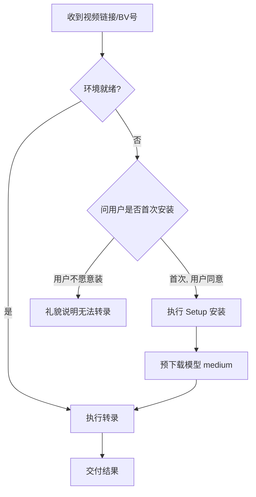

# Bilibili Transcriber(视频转文字)

## Overview

将 B 站(及 yt-dlp 支持的其他平台)视频的语音内容自动转为文字。流程为:
**解析输入(BV/av/链接) → yt-dlp 下载最佳音轨 → faster-whisper 中文语音识别
→ 输出纯文本与/或 SRT 字幕**。内置系列视频枚举、错误映射与"省 token"输出约定。

## 🚀 快速启动决策树 (Agent 必读)

**首次使用本技能的用户**，按以下流程执行。**注意：首次安装约需下载 1.5GB 模型文件**，务必先跟用户确认：



> **铁律**: 转录任务**必须**用 `run_in_background` 启动（详见 Step 2），因为 Bash 工具默认超时 120 秒而转录通常需要数分钟。不用 `run_in_background` 导致超时中断被视为**技能使用错误**。

## 可靠性与效率特性

- **断点续传(`--resume`)**: 长合集转录中途失败, 重跑加 `--resume` 自动复用最新 run 目录, 跳过已完成视频, 只处理剩余项。进度持久化在 `run_dir/progress.json`(原子写)。
- **进度回调(`--progress-file`)**: 增量写进度到指定 JSON 文件, agent 可轮询实时查看"第几集/共几集/已失败项", 长任务不再像黑盒。
- **并发转录(`--jobs N`)**: 系列视频共享单模型实例并发推理。GPU 模式自动加锁串行化(避免显存爆炸), CPU 模式可 `--jobs 2-4` 提速。
- **音频缓存(`--cache-dir`)**: 按视频 id 复用转码后 wav, 同一视频重复转录跳过下载, 显著省时省流量。默认 `<out-dir>/.audio_cache`。
- **模型完整性校验**: 本地模型目录不仅检查 `model.bin`, 还校验 `config.json` / `tokenizer.json`, 残缺模型会跳过并警告, 不再加载到一半才报错。
- **preview 改进**: `--preview N` 现拼接所有段取前 N 字符, 比只取首段更具代表性(首段往往是"大家好"寒暄)。
- **GPU 逻辑解耦**: cuBLAS 检测/启用逻辑下沉到独立模块 `gpu_utils.py`, `transcribe.py` 不再隐式依赖 `setup_env.py`(后者含 pip 安装副作用)。跨平台: Linux/macOS 跳过 DLL 复制, 直接用 ctranslate2 wheel 自带运行时。
- **段落合并(`--text-mode merged`)**: txt 输出默认按 VAD 段间静音间隔做语义分段(gap<1.5s 紧密拼接、1.5-3s 加句号、>=3s 空行分段), 可读性远高于逐行拼接; `--text-mode raw` 可切回旧行为。
- **模型自动选择(`--model auto`)**: 按系列总时长自动选模型 — <10min 用 `large-v3`(精度优先)、10-60min 用 `medium`(平衡)、>60min 用 `small`(速度优先), 拿不到时长回退 `medium`。
- **说话人分离(`--diarize`, 可选)**: 开启后 txt/srt 每段标注 `[说话人]`, 适合访谈/多人对话。基于 `pyannote.audio`(可选依赖, 需 `HF_TOKEN`), 未安装时自动降级为普通转录并提示。
- **环境一键检查(`--check-env`)**: 无需依赖安装即可快速检测 Python 版本、yt-dlp/faster-whisper/ffmpeg 安装状态、本地模型完整性、GPU 可用性、磁盘剩余空间, 输出结构化 JSON 报告。适合 Setup 后验证或故障排查。
- **预计耗时估算**: 转录启动前根据音频总时长、模型大小、设备类型(CPU/GPU)自动估算并显示预计完成时间, 让用户有明确心理预期, 不再"黑盒空转"。
- **VAD 参数可调(`--min-silence-duration-ms`)**: 将之前硬编码的 VAD 最小静音时长(默认 500ms)暴露为命令行参数。调大(如 1000)让句子更连贯, 调小(如 300)让分段更精细, 适合不同语速的内容。

## When to Use

- 用户给出 B 站视频链接 / BV 号 / av 号 / b23.tv 短链, 想要文字稿。
- 需要视频字幕(.srt)或纯文本转录。
- 涉及分P / 合集 / 系列视频, 需批量处理其中若干集。
- 需要中文语音识别, 并希望有基本错误处理(视频不存在、无法访问、网络失败等)。

## ⚡ 持久化跨会话 Setup (D 盘 · 推荐 · 仅需一次)

**⚠️ 核心坑**: WorkBuddy 沙箱环境是**会话级临时**的——每次新对话启动, 之前建的 venv 和 HF 缓存目录都可能不可用。
**✅ 解法**: 把所有重资产（venv、模型、缓存）装到 **D 盘**持久化路径下, 一次安装永久复用。不占用 C 盘系统空间。

所有路径由脚本内的 `BILI_HOME`(默认 `D:\workbuddy\.bili-transcriber`)统一解析, 与技能目录、安装目录解耦, 技能更新不会丢失数据。

```
D:\workbuddy\.bili-transcriber\   ← 所有数据都在这里
├── venv\           # Python 虚拟环境 (pip 依赖 ~200MB)
├── models\         # Whisper 模型文件 (medium=1.5GB)
├── cache\          # 音频缓存 (视频越多越大)
└── transcripts\    # 默认输出目录
```

### 第1步: 检查是否已安装 (2 秒预检)

```bash
D_BILI="D:/workbuddy/.bili-transcriber"
ls "$D_BILI/venv/Scripts/python.exe" && ls "$D_BILI/models/medium/model.bin"
```

- ✅ 两条都命中 → **直接跳到 Workflow, 不用跑任何 Setup**
- ❌ 任意一条失败 → 继续下面的安装

### 第2步: 创建 D 盘 venv + 安装依赖 + 预下载模型

```bash
D_BILI="D:/workbuddy/.bili-transcriber"

# A) 用托管 Python 在 D 盘创建 venv (仅一次)
"C:/Users/PFH/.workbuddy/binaries/python/versions/3.13.12/python.exe" \
  -m venv "$D_BILI/venv"

# B) 安装依赖 (yt-dlp + faster-whisper + imageio-ffmpeg)
"$D_BILI/venv/Scripts/python.exe" scripts/setup_env.py

# C) 预下载模型 (推荐 medium, 约 1.5GB)
"$D_BILI/venv/Scripts/python.exe" scripts/setup_env.py --download-model medium
```

> **各模型磁盘占用**: small ≈ 460MB, medium ≈ 1.5GB, large-v3 ≈ 3GB
> **推荐 `medium`**: 速度/精度平衡最佳

### 第3步: 验证

```bash
D_BILI="D:/workbuddy/.bili-transcriber"

# 验证依赖
"$D_BILI/venv/Scripts/python.exe" \
  -c "import yt_dlp, faster_whisper, imageio_ffmpeg; print('✅ 依赖全部就绪')"

# 验证模型完整性 (自动校验 model.bin + config.json + tokenizer.json)
ls "$D_BILI/models/medium/model.bin" && echo "✅ 模型就绪"
```

> **如果验证失败**:
> - venv 问题 → 删掉 `$D_BILI/venv` 重跑第2步-A
> - 模型下载失败 → 重跑 `scripts/setup_env.py --download-model medium`
> - 模型不完整 → 检查 model.bin / config.json / tokenizer.json 三个文件是否齐全

### 后续会话: 环境变量速查

转录时导出以下变量即可直接复用（也可写进 shell profile）:

```bash
# 建议存到 ~/.bashrc 或 WorkBuddy 的工作区 memory
export BILI_PYTHON="D:/workbuddy/.bili-transcriber/venv/Scripts/python.exe"
export BILI_MODEL_DIR="D:/workbuddy/.bili-transcriber/models"
export BILI_CACHE_DIR="D:/workbuddy/.bili-transcriber/cache"
export BILI_OUT_DIR="D:/workbuddy/.bili-transcriber/transcripts"
export BILI2TEXT_MODEL_DIR="$BILI_MODEL_DIR/medium"
```

```bash
# 转录时直接用
"$BILI_PYTHON" scripts/transcribe.py "BV1xx411c7mD" \
  --out-dir "$BILI_OUT_DIR/$(date +%Y%m%d)" \
  --model medium \
  --cache-dir "$BILI_CACHE_DIR"
```

> **自动探测机制(已更新)**: `transcribe.py` 通过统一的 `BILI_HOME` 解析器定位模型与数据目录,
> 优先级为 `BILI2TEXT_MODEL_DIR` 环境变量 → `<BILI_HOME>/models/<name>` →
> 旧版 `<技能目录>/models/<name>`(仅作回退, 技能更新时会被覆盖)。`BILI_HOME` 默认
> `D:\workbuddy\.bili-transcriber`(已存在的持久化根, 独立于技能/安装目录), 可用环境变量覆盖,
> 回退到 `~/.bili-transcriber`。因此 **D 盘模型无需再手动设 `BILI2TEXT_MODEL_DIR` 即可自动命中**;
> 仅当模型放在非默认位置时才需显式指定 `BILI2TEXT_MODEL_DIR`。

### 迁移指南（已有模型 → BILI_HOME 持久化根）

模型与缓存现由 `BILI_HOME`(默认 `D:\workbuddy\.bili-transcriber`)统一解析, 技能目录不再存放数据, 技能更新不会丢模型。若你已有模型在别处(旧技能目录 `.../skills/bilibili-transcriber/models`、C 盘 venv 等), 不想重新下载约 1.5GB, 把它拷到持久化根即可——脚本会自动探测, 无需手设环境变量:

```bash
D_BILI="D:/workbuddy/.bili-transcriber"

# 1) 在 D 盘创建 venv(若尚未创建)
"C:/Users/PFH/.workbuddy/binaries/python/versions/3.13.12/python.exe" \
  -m venv "$D_BILI/venv"

# 2) 拷贝已有模型到持久化根(把 <OLD_MODEL_DIR> 换成你的旧模型目录, 内含 model.bin 等)
cp -r "<OLD_MODEL_DIR>" "$D_BILI/models/medium"

# 3) 安装依赖到新 venv
"$D_BILI/venv/Scripts/python.exe" scripts/setup_env.py

# 4) 验证: 模型落在 BILI_HOME/models, 脚本可自动探测
"$D_BILI/venv/Scripts/python.exe" \
  -c "import yt_dlp, faster_whisper, imageio_ffmpeg; print('✅ 依赖就绪')"
ls "$D_BILI/models/medium/model.bin" && echo "✅ 模型已就位 (BILI_HOME)"
```

> 注: 本机已默认装好 D 盘持久化根(venv + medium 模型), 一般无需迁移, 直接跳到 Workflow 即可。

## Setup (备选 · 临时/沙箱环境)

如果你在其他机器或纯临时沙箱中运行(无上述持久化路径), 则每次从头安装:

```bash
# 以托管 Python 虚拟环境解释器运行(若 venv 尚未创建, 先: python -m venv $VENV):
$VENV_PYTHON "scripts/setup_env.py"
# 可选: 先检测本机 GPU 情况(打印 JSON, 不改动):
$VENV_PYTHON "scripts/setup_env.py" --detect-only
# 可选: 一次性预下载模型到 <BILI_HOME>/models/(默认 D:\workbuddy\.bili-transcriber\models), 之后离线、稳定加载(推荐, 见下方说明)
$VENV_PYTHON "scripts/setup_env.py" --download-model small
```

> **关于虚拟环境变量**: `$VENV` 指你的 Python 虚拟环境目录, `$VENV_PYTHON` 指其解释器(类 Unix: `$VENV/bin/python`, Windows: `$VENV\Scripts\python.exe`)。若尚未创建, 先 `python -m venv "$VENV"`(例如 `python -m venv .venv`)。也可直接用任意已装好依赖的 Python 解释器运行本技能脚本。

- 安装完成即可使用。模型默认在首次转录时从 HuggingFace 下载(见 `references/asr_engines.md`), 仅一次。
- **GPU / CPU 自动感知(关键)**: `setup_env.py` 默认 `--device auto`, 会:
  1. 调用 `ctranslate2.get_cuda_device_count()` 检测是否有 NVIDIA GPU;
  2. 若**有 GPU 但 `ctranslate2` 包内缺 cuBLAS 12 运行时**(常见: `cublas64_12.dll is not found`), 自动从系统已有的 NVIDIA 目录(NGX / CUDA Toolkit / System32)复制 `cublas64_12.dll` / `cublasLt64_12.dll` / `cudart64_12.dll` 进 `ctranslate2` 包目录, **一键启用 GPU**, 无需手动装 CUDA Toolkit;
  3. 若**无 GPU**, 自动回退 CPU。
  - 也可显式 `--device cpu`(强制 CPU) 或 `--device cuda`(强制启用 GPU, 同样会自动复制 cuBLAS)。
  - `ctranslate2` 的 PyPI wheel 本身就是 **CPU+CUDA 双用**的同一个包, 不存在"分别安装 GPU 版/CPU 版"——真正的开关是推理设备(device), 见下方说明。
- **询问用户**: 若你不确定本机有无 GPU, 可先用 `--detect-only` 看结果; 或在装配环境前用 AskUserQuestion 问用户「用 GPU 还是 CPU?」, 再把 `--device` 传进去。
- **强烈建议先 `--download-model`** 预下载: 在沙箱/离线/镜像环境, 运行时临时下载常踩坑(符号链接 checkout 失败、大文件走 Xet/CAS 在镜像上 401)。预下载会把模型落地到 `<BILI_HOME>/models/<name>/`(含 `model.bin`, BILI_HOME 默认 `D:\workbuddy\.bili-transcriber`)。**`transcribe.py` 现在会自动探测 `<BILI_HOME>/models`**, 因此预下载后直接 `--model <name>` 即可离线加载, 无需再手设 `BILI2TEXT_MODEL_DIR`(该变量仍可作为显式覆盖, 优先级高于自动探测)。
- 后续所有调用均用该 venv 解释器运行 `scripts/transcribe.py`。

## Environment Prerequisites(环境前置 · 必读)

`scripts/transcribe.py` 启动时会**自动设置**以下环境变量(若你已显式指定则不覆盖)。在本沙箱/镜像/离线环境中, 这些是跑通的关键:

| 环境变量 | 取值 | 作用 |
|---------|------|------|
| `CODEBUDDY_SAFE_DELETE_SANDBOX` | `0` | 关闭沙箱删除钩子, 否则清理临时文件会强行抛 `OSError` |
| `HF_ENDPOINT` | `https://hf-mirror.com` | HuggingFace 镜像, 加速/可访问 |
| `HF_HUB_DISABLE_SYMLINKS` | `1` | 沙箱内符号链接 checkout 失败 → 改用复制 |
| `HF_HUB_DISABLE_XET` | `1` | 大文件走 Xet/CAS 在镜像上 401 → 改普通 HTTPS |
| `BILI2TEXT_MODEL_DIR` | 模型目录路径(可选) | 指向含 `model.bin` 等完整文件的本地目录, 跳过 HF 缓存/下载(完整性校验: 缺文件则跳过并警告) |
| `OMP_NUM_THREADS` | 如 `4`(可选) | 限制 CPU 线程数, 避免占满核 |

> 你能直连官方 HF 时, 可在调用前 `unset HF_ENDPOINT HF_HUB_DISABLE_SYMLINKS HF_HUB_DISABLE_XET` 改用官方源; 其余变量保留无害。

**关键实现说明(已固化, 无需你手动处理):**
- **ffmpeg 缺 ffprobe**: `imageio-ffmpeg` 只提供 `ffmpeg`, 没有 `ffprobe`。脚本因此**不**使用 yt-dlp 的 `FFmpegExtractAudio` 后处理, 而是直接下载原始音轨(m4a/opus/webm), 再用内置 `ffmpeg` 显式转成 16k 单声道 wav(`-ar 16000 -ac 1 -vn`)。全程只依赖 ffmpeg, 不碰 ffprobe。
- **GPU / CPU 自动选择**: `transcribe.py` 默认 `--device auto`, 自动检测 GPU 并选择 cuda/cpu。GPU cuBLAS 启用机制(无需手动装 CUDA Toolkit)见上方「Setup (备选)」章节。缺 cuBLAS 时自动回退 CPU。

## Workflow

### Step 0 — 预检: 程序化路径发现 + 汇报给用户 (3 秒)

每次调用此技能时, **优先用 `scripts/find_paths.py` 做预检**, 而不是手动写 shell 变量猜路径。
`find_paths.py` 是 BILI_HOME 解析器的**单一事实来源**, 其输出比 shell 硬编码可靠。

```bash
# 1) 用 find_paths.py 自动发现路径 (输出 JSON)
#    需要先找一个可用的 Python 解释器来跑它。
#    候选方案（按优先级）:
#     a) D 盘 venv: D:/workbuddy/.bili-transcriber/venv/Scripts/python.exe
#     b) 托管 Python: C:/Users/PFH/.workbuddy/binaries/python/versions/3.13.12/python.exe
#     c) 系统 Python: python3 / python

# 建议: 用托管 Python 跑 find_paths.py（不依赖 venv 是否存在）
PYTHON_PROBE="C:/Users/PFH/.workbuddy/binaries/python/versions/3.13.12/python.exe"
if [ ! -f "$PYTHON_PROBE" ]; then
    # 回退到系统 python
    PYTHON_PROBE="python3"
    command -v "$PYTHON_PROBE" || PYTHON_PROBE="python"
fi

# 用 find_paths.py 获取完整的环境报告
ENV_JSON=$("$PYTHON_PROBE" "scripts/find_paths.py" 2>/dev/null)

# 从 JSON 中提取关键字段（用 python -c 做安全解析）
eval $(echo "$ENV_JSON" | "$PYTHON_PROBE" -c "
import sys,json
d=json.load(sys.stdin)
# 导出为 shell 变量
print(f'ENV_OK={\"true\" if d[\"ok\"] else \"false\"}')
print(f'BILI_HOME={d[\"bili_home\"]}')
print(f'VENV_PYTHON={d[\"venv_python\"] or \"\"}')
print(f'ACTIVE_MODEL={d[\"active_model\"] or \"\"}')
print(f'MODEL_DIR={d[\"models\"].get(d[\"active_model\"],{}).get(\"path\",\"\") if d[\"active_model\"] else \"\"}')
print(f'CACHE_DIR={d[\"cache_dir\"]}')
print(f'OUT_DIR={d[\"out_dir\"]}')
print(f'GPU_TYPE={d[\"gpu\"][\"device_type\"]}')
# 输出 issues 汇总 + notes 正面信息
issues = d.get('issues', [])
for iss in issues:
    print(f'ISSUE: {iss}')
notes = d.get('notes', [])
for n in notes:
    print(f'NOTE: {n}')
") || {
    echo "⚠️ find_paths.py 解析失败，请手动检查路径"
    ENV_OK="false"
}

# 检查关键变量是否均有效
if [ "$ENV_OK" = "true" ] && [ -n "$VENV_PYTHON" ] && [ -f "$VENV_PYTHON" ] && [ -n "$MODEL_DIR" ]; then
    echo "✅ 环境就绪: $VENV_PYTHON | 模型=$ACTIVE_MODEL | GPU=$GPU_TYPE"
else
    echo "⚠️ 环境不完整，需要先执行 Setup"
    echo "   VENV_PYTHON=$VENV_PYTHON, MODEL_DIR=$MODEL_DIR"
fi
```

**预检失败后不要硬着头皮跑** — 向用户解释缺失了什么（可直接用 `ISSUE:` 的文本），引导用户完成 Setup。

预检通过后, 后续所有命令用 `$VENV_PYTHON` / `$MODEL_DIR` / `$CACHE_DIR` / `$ACTIVE_MODEL` 替代硬编码路径。

> **⚠️ 变量 session 生命周期**: Step 0 输出的 `$VENV_PYTHON` 等 shell 变量**只在当前 Bash 调用内有效**。
> 如果你分多次 Bash 工具调用（如 Step 0 一个调用、Step 1 另一个调用），
> **必须将 Step 0 和 Step 1 合并到同一个 Bash 命令中**，或者用 `export` 持久化到当前 agent session：
>
> ```bash
> # 方式 A: 合并到单一 Bash 调用
> # 预检 → 转录
> eval $(... find_paths.py 解析...)  # 设置变量
> "$VENV_PYTHON" scripts/transcribe.py "$INPUT" ...
>
> # 方式 B: export 持久化
> export VENV_PYTHON MODEL_DIR CACHE_DIR ACTIVE_MODEL
> ```
>
> 推荐方式 A（合并调用），简单可靠。

> **给用户的交互提示**: 预检通过后, agent 应先给用户一段简明策略说明, 再开始。示例:
> > ✅ 环境就绪（venv + $ACTIVE_MODEL 模型）。📋 策略: 本合集 12 个视频约 45 分钟, ${GPU_TYPE/cuda/GPU推理预计 15-20 分钟/CPU推理预计约 1 小时}, 标准反馈模式, 已启用转录缓存。现在开始下载音轨…
>
> 让用户知道: a) 不会重新下载依赖; b) 用了哪个模型/设备; c) 范围与预估耗时; d) 当前在做什么。

### Step 1 — 解析输入并决定是否先枚举系列

1. 识别用户输入中的链接 / BV 号 / av 号。
2. **若可能是系列/分P/合集**, 先执行枚举(不下载、不转录, 极省 token):

   ```bash
   $VENV_PYTHON "scripts/transcribe.py" "$INPUT" --list-only
   ```

   脚本返回 JSON: `{"ok": true, "mode": "list", "count": N, "videos": [{index,id,title,duration}...]}`。
3. 把清单呈现给用户, 确认处理范围:**全部 / 前 N 集(`--limit N`) / 指定分P**。
   - 单视频(清单仅 1 条)可跳过此步直接转录。

### Step 2 — 下载并转录 (带进度反馈)

正式运行。**必须对用户输出明确的进度反馈**, 不要默默跑完。

> **🚨 超时铁律**: Bash 工具默认超时 120 秒。**转录任务必须用 `run_in_background` 启动**。
> 正确: `run_in_background: true, command: "$VENV_PYTHON scripts/transcribe.py ..."`
> 错误: 直接用 Bash 工具跑转录而不设 `run_in_background`。
> 用 `run_in_background` 后, 脚本在后台运行, 你通过 `--progress-file` 轮询获取进度,
> 用 `TaskOutput` 在任务完成时拿结果。这让转录数分钟级任务不会因超时被杀死。

```bash
# 设置 D 盘持久化路径
OUT_DIR="${OUT_DIR:-$BILI_HOME/transcripts/$(date +%Y%m%d)}"
PROGRESS_FILE="$OUT_DIR/.progress.json"
mkdir -p "$OUT_DIR"

# ↑ 预检阶段已设好 VENV_PYTHON / MODEL_DIR / CACHE_DIR / ACTIVE_MODEL

# 设置脚本所需环境变量(详见「Environment Prerequisites」章节)
export BILI2TEXT_MODEL_DIR="$MODEL_DIR"

# =====================================================================
# 【关键】用 run_in_background 启动转录，避免 Bash 超时杀死进程
# =====================================================================
# 在 agent 的实际工具调用中，这对应：
#   tool: Bash
#   params: {
#     command: "...",
#     run_in_background: true      # ← 必须！转录通常 > 2 分钟
#   }
# =====================================================================
$VENV_PYTHON "scripts/transcribe.py" "$INPUT" \
    --out-dir "$OUT_DIR" \
    --model "$ACTIVE_MODEL" --lang zh --format "${FORMAT:-txt}" \
    --device auto --compute-type auto \
    --cache-dir "$CACHE_DIR" \
    --transcript-cache "$CACHE_DIR/transcripts" \
    --compact \
    --progress-file "$PROGRESS_FILE" \
    [--limit N] [--preview 120] \
    [--jobs N] [--resume] [--text-mode merged|raw] [--diarize]
```

#### 🔄 超时与中断恢复策略

| 场景 | 表现 | 处理方法 |
|------|------|---------|
| Bash 超时杀死 (120s) | agent 收到 `timeout` 错误 | 使用 `--resume` 重新运行, 跳过已完成视频; **下次必须用 run_in_background** |
| 转录中途中断 | 脚本未正常退出, 部分已完成 | `--resume` 自动检测已有 progress.json 并继续 |
| 模型下载超时 | 首次运行时 HF 下载慢 | 用 `setup_env.py --download-model` 预下载, 或直接用 `BILI2TEXT_MODEL_DIR` 指定本地模型 |
| yt-dlp 下载超时 | 某集视频下载失败 | `--resume` 跳过失败项, 继续处理其余; 手动重试失败项 |
| GPU OOM (显存溢出) | 模型加载失败 | 切 `--model small` 或 `--device cpu --compute-type int8` |

**核心原则**: **转录失败不要整体重跑, 加 `--resume` 续传即可**, 脚本会自动跳过已完成的项。

#### 🐾 watchdog 心跳输出

`transcribe.py` 在 `model.transcribe()` 阻塞期间会自动启动 **watchdog 线程**,
每 15 秒向 stderr 输出一次:

```
[HH:MM:SS] [进度] 仍在识别: 01_BV1xx.m4a (已用 45 秒)
[HH:MM:SS] [进度] 仍在识别: 01_BV1xx.m4a (已用 60 秒)
```

这些心跳可以帮助你在长任务期间**感知到脚本还在运行**。当使用 `run_in_background` 时, 
你无法实时看到 stderr, 但可以通过 `--progress-file` 轮询获得进度快照; 
当转录完成, `TaskOutput` 会一次性返回全部输出(含这些心跳行)。

#### 进度反馈规范 (agent 必读)

在转录进行时（尤其长视频/合集）, agent **必须**周期性地向用户报告进度:

| 阶段 | 用户能看到什么 | agent 怎么做 |
|------|---------------|-------------|
| 环境检查 | `🔍 正在检查运行环境…` | `--check-env` 快速验证依赖和模型状态 (2 秒) |
| 下载音轨 | `⏳ 正在下载音轨… (视频时长约 12min)` | 从 stderr 的 `[进度] 正在下载音轨` 转发 |
| 加载模型 | `🧠 加载语音识别模型: medium` | 从 stderr 的 `[进度] 加载语音识别模型` 转发 |
| 预计耗时 | `⏱ 预估: 总时长 45min, GPU/medium, 约 36 分钟完成` | 脚本自动估算并显示于 `[预计]` 标签 |
| 识别中 | `📝 正在识别: 01_BV1xx.mp4 (第 3/12 个视频)` | 从 stderr 的 `[进度] 识别中` 转发 |
| 完成 | `✅ 已完成 3/12, 失败 0` | 从 stderr 的 `[完成]` 汇总 |
| 合集进度(长任务) | `📊 合集进度: 5/12 已完成, 预计剩余 ~8min` | 轮询 `--progress-file` JSON, 向用户汇报 |

**长任务 (>5 分钟) 的进度汇报策略**:
1. 转录启动时告诉用户: *"开始转录, 共 12 个视频, 总时长约 45 分钟, 用的 medium 模型"*
2. 每完成 3-5 个或每 2 分钟更新一次: *"已处理 7/12, 失败 0 个"*
3. 全部完成后给出最终摘要: *"全部完成! 12/12 个视频转录成功, 输出到 D 盘 transcripts 目录"*

> **`--progress-file` 文件内容格式**:
> ```json
> {"total":12, "done_count":5, "failed_count":0,
>  "done_ids":["BV1xx","BV1yy","BV1zz"], "failed_ids":[],
>  "updated_at":1741766400}
> ```
> 用 `cat "$PROGRESS_FILE"` 轮询即可获得实时快照。

- `--model`: 默认 `medium`; `auto` 按时长自动选(见特性章节)。模型权衡见 `references/asr_engines.md`。
- `--device` / `--compute-type`: 默认 `auto` / `auto`(自动检测 GPU)。
- `--lang zh`: 中文视频用 `zh`; 多语种用 `auto`。
- `--format`: `txt`(默认) / `srt` / `both`。需要 SRT 时事前询问用户。
- `--limit N`: 系列仅处理前 N 集。
- `--diarize`: 说话人分离, 需额外配置 pyannote.audio + HF_TOKEN, 见 `references/asr_engines.md`。
- `--check-env`: 快速检测运行环境(依赖/模型/GPU/磁盘), 打印 JSON 报告后退出, 不执行转录。
- `--min-silence-duration-ms`: VAD 最小静音时长(毫秒), 默认 500。调大(如 1000)让句子更连贯, 调小(如 300)让分段更细。
- 其余参数(`--preview`/`--jobs`/`--resume`/`--cache-dir`/`--text-mode`/`--prune-runs`/`--transcript-cache`)均有合理默认值, 详细见 `references/asr_engines.md`。

> **⚠️ 语言默认值提醒**: `--lang` 默认为 `zh`(面向 B 站中文视频优化)。若转写**非中文 / 外语 / 多语种**视频(如 YouTube 英文), 务必显式传 `--lang auto`, 否则会被强制按中文识别导致准确率崩盘。

脚本完成后的 stdout 为单个 JSON 摘要(进度日志在 stderr, 不污染结果):

```json
{"ok": true, "mode": "transcribe", "model": "medium", "run_dir": "...",
 "count": 2, "total": 2, "done": 2, "failed": 0, "failed_ids": [],
 "results": [
   {"audio": "...", "language": "zh", "duration_sec": 612.3,
    "txt": ".../01_BVxxx.txt", "srt": ".../01_BVxxx.srt",
    "chars": 8421, "segments": 213, "preview": "大家好, 今天我们来..."}
 ]}
```

### Step 3 — 呈现结果 (交互增强版)

**不要**把 `.txt` / `.srt` 正文读入上下文。用 **present_files** 交付, 同时在对话中给用户一个清晰的摘要卡片:

```
━━━━━━━━━━━━━━━━━━━━━━━━━━━━━━━━━━━━━━━
 ✅ 转录完成
━━━━━━━━━━━━━━━━━━━━━━━━━━━━━━━━━━━━━━━
 📁 输出目录: D:\workbuddy\.bili-transcriber\transcripts\20260713
 📄 文件数:      3 个视频
 📝 总字数:      12,847 字
 ⏱ 总时长:      38 分 21 秒
 🌐 识别语言:    zh (中文)
 💾 模型:        medium / CPU
 🗂 格式:        .txt (若用户选了 SRT 则显示 .txt+.srt)
 ❌ 失败:        0
━━━━━━━━━━━━━━━━━━━━━━━━━━━━━━━━━━━━━━━
```

交付格式:
1. 用 `present_files` 一次性列出所有产出文件
2. 如果用户只想要"大意", 可展示 JSON 中的 `preview` 字段(前 N 字符), 而非全文
3. 如果用户想要全文摘要, 后续用其他技能对 `.txt` 文件做摘要, 不要把全文贴回对话
4. 多个文件时, 用 `present_files` 一次性列出所有产出路径

## 用户交互与反馈规范 (agent 必读)

本技能的**交互质量**直接决定用户对工具的好感度。以下规范强制约束 agent 的沟通方式。

### 0. 启动前必须描述执行策略（强制, 长任务尤其重要）

**在正式开始转录前, agent 必须先给用户一段简明的「执行策略」说明**, 让用户知道接下来会发生什么、要花多久、用什么配置。绝不允许二话不说直接开跑、或全程沉默。策略至少包含:

- **范围**: 处理哪些视频(全部 / 前 N 集 / 指定分P), 共几个、总时长约多少
- **配置**: 用哪个模型(medium / 按时长 auto)、走 GPU 还是 CPU
- **预估耗时**: 基于总时长+模型+设备给出预计完成时间(如 "约 36 分钟")
- **反馈模式**: 本次用标准 / 详细 / (仅当用户明确要求) 静默
- **复用情况**: 是否命中转录缓存 / 是否用 `--resume` 断点续传(跳过已完成项)

示例(合集任务):
> 📋 执行策略: 这个合集共 12 个视频, 合计约 45 分钟。用 medium 模型 + GPU 推理, 预计 15-20 分钟完成。采用标准反馈(每处理几个或每 2-3 分钟汇报一次), 中途可随时让我暂停。已启用转录缓存, 重复视频秒回。

单视频 / 短任务(<5 分钟)也至少一句话带过范围与模型, 不必展开。

### 1. 每次操作前说清楚在干什么

| 操作 | agent 对用户的说话 |
|------|------------------|
| 预检通过 | `✅ 环境就绪，D 盘持久化 venv + medium 模型，开始转录…` |
| 下载音轨 | `⏳ 正在下载视频音轨 (视频时长约 12 分钟)…` |
| 加载模型 | `🧠 加载语音识别模型 medium，首次加载约 10 秒…` |
| 识别进行中 | `📝 正在识别 第3/12 个视频…` |
| 合集长任务 | `📊 已处理 5/12，失败 0，继续… 可随时让我暂停` |
| 全部完成 | `✅ 全部完成！请查收下方输出文件` |
| 模型下载(首次) | `⏳ 首次使用，正在下载 whisper 模型 (medium, 约 1.5GB, 取决于网络速度)…` |
| GPU 加速 | `⚡ 检测到 NVIDIA GPU，使用 CUDA 加速推理` |
| 失败 | `❌ 第3个视频转录失败: [原因]。已跳过，继续处理其余视频` |

### 2. 长任务进度汇报策略（长任务绝不允许"反馈极少"）

**铁律: 任何超过 5 分钟的任务, 都必须有持续心跳式反馈, 不能一声不吭跑到结束。** 用户感知不到进度 = 体验失败。

- **< 1 分钟**: 开始 + 结束各一次
- **1-5 分钟**: 开始 → 中途至少 1 次 → 结束
- **> 5 分钟（合集 / 长视频）**: **每 2-3 分钟** 或 **每完成 2-3 个视频** 必须更新一次(取更密集者); 同时至少要有一次**中点 checkpoint**(如 "已过半 6/12, 预计还剩 ~18 分钟")
- **> 30 分钟**: 在上述基础上, 每次更新附带「已完成/总数 + 失败数 + 预计剩余」三要素
- 合集任务**启动时必须**先描述策略(见上方 §0)并告知总集数与预估时长
- 使用 `--progress-file` 轮询获取实时进度, 不要靠猜; 轮询结果要**转述给用户**, 不要只在内部记着

> 反例(禁止): 12 个视频跑了 40 分钟, 中途只说过一句"开始转录" → 这是**严重违规**, 用户会以为卡死。

### 3. 错误处理的交互

| 场景 | agent 对话规范 |
|------|--------------|
| 视频不存在 | `❌ 视频不存在或已下架，请确认链接或 BV 号是否正确` |
| 下载失败 | `⚠️ 下载超时，可能是网络问题，要重试吗？` |
| 模型缺失 | `⚠️ 模型未预下载，正在从 HuggingFace 镜像下载 (约 1.5GB)…` |
| GPU 不可用 | `ℹ️ 未检测到 CUDA GPU，使用 CPU 推理 (会比 GPU 慢 3-5 倍)` |

> **不要**向用户展示原始异常栈或`{"ok": false}` JSON。把 error 字段的中文提示直接转述。

### 4. 首次使用的引导

如果预检发现环境缺失, agent 应向用户说明:

> 🛠 首次使用需要安装环境（仅一次），会将依赖和模型安装到 D 盘持久化目录
> `D:\workbuddy\.bili-transcriber\`
> - 依赖约 200MB
> - 语音模型 medium 约 1.5GB
> - 安装完成后后续会话直接复用，不再下载
>
> 是否继续安装？

获得用户确认后再执行 Setup。

### 5. Token/反馈平衡策略 (关键)

**核心矛盾**: 进度反馈越详细 → 消耗 token 越多。以下策略在用户体验和 token 消耗之间取得最佳平衡。

#### 5a. 前置询问: 让用户选择反馈密度 + 格式

**每个任务前, 都问一句是否需要 SRT 字幕** (默认仅 txt):

> 输出格式: 纯文本(.txt) 还是 文本+字幕(.txt+.srt)?
> SRT 字幕适合需要精确时间轴定位的场景, 体积是 txt 的 2-3 倍。
> 默认仅 txt, 需要 SRT 吗? (Y/n)

如果用户选了需要 SRT, 转录时加 `--format both`。否则只用默认 `--format txt`。

**在开始合集任务 (>2 个视频)** 前, 确认反馈模式(默认标准, 长任务不建议静默):

> 这个合集有 12 个视频, 约 45 分钟。转录期间想怎么接收进度?
> **B) 标准模式 📊（默认/推荐）** — 每 2-3 分钟或每几个视频汇报一次, 含中点 checkpoint
> **C) 详细模式 📝** — 每完成一个视频都通报
> **A) 静默模式 📄** — 仅开始时说一句策略、结束时给结果, 中间不主动报(⚠️ 仅当用户明确说"不用管我/我在忙"时可选; 长任务静默易让人以为卡死)

如果是**单视频或短任务 (<5 分钟)**, 默认标准模式, 不用问。

#### 5b. 智能轮询: 根据预估时长校准频率(内部检查节奏)

> 轮询是 **agent 内部**检查 `--progress-file` 的节奏; 它决定了你**最快能多快**把进度转述给用户。
> 用户面向的更新频率以 §2 为准(>5 分钟任务每 2-3 分钟或每几个视频一次), 因此**内部轮询不能比 §2 更稀疏**。

```
--list-only 拿到视频时长 →
  总时长 < 5 分钟  → 不轮询, 等完成
  总时长 5-30 分钟 → 每 2-3 分钟轮询一次(并转述给用户)
  总时长 30-60 分钟 → 每 2-3 分钟轮询一次
  总时长 > 60 分钟 → 每 2-3 分钟轮询一次(长任务更需心跳, 不因长就放宽)
```

即: **轮询节奏跟随 §2 的汇报节奏, 长任务反而要更密**, 不因视频长就无限放宽。

#### 5c. 转录缓存: 同一视频第二次 0 token 消耗

```bash
# 添加 --transcript-cache 指向持久化缓存目录
# 同一 BV 号第二次转录直接返回结果, 跳过下载和 ASR
$VENV_PYTHON scripts/transcribe.py "$INPUT" \
  --transcript-cache "${TRANSCRIPT_CACHE_DIR:-$CACHE_DIR/transcripts}" \
  ...
```

**节省量**: 一个 10 分钟视频 ≈ 15 秒下载 + 2 分钟 ASR → **整个流程跳过**。

#### 5d. Compact 模式: 精简 JSON 输出

```bash
# --compact 让结果 JSON 更短 (字段名从全称缩写为 2-3 字符)
$VENV_PYTHON scripts/transcribe.py "$INPUT" --compact ...
```

**节省量**: JSON 体量缩小约 60% (`"txt"` → `"tx"`, `"duration_sec"` → `"d"`)。

#### 5e. 省 token 清单 (决策速查)

| 策略 | 省什么 token | 影响 | 推荐场景 |
|------|-------------|------|---------|
| 转录缓存 | 整个转录流程 | C 盘空间+1 倍 | 反复看同系列视频 |
| compact 模式 | JSON 输出大小 -60% | 可读性略降 | 合集/批量任务 |
| 静默模式 | 全部进度对话 | 用户全程看不到进度(易误判卡死) | 仅当用户明确说"不用管我"时 |
| 标准模式(默认) | 适中 | 质量 OK | 大多数场景 |
| --preview 120 | 结果预览省全文 | 只省读取步骤 | 用户只要大意时 |
| --no-transcript-cache | — | 不存缓存 | 一次性任务 |

## 配置选项

### 环境变量速查 (可写进 WorkBuddy Memory 或 .bashrc)

```bash
# =============================================
# bilibili-transcriber 持久化配置
# 建议写到 ~/.bashrc 或 ~/.profile 中
# =============================================

# 基础路径 (所有重资产都在持久化根, 独立于技能/安装目录)
# BILI_HOME 为脚本读取的规范变量(旧文档的 BILI_BASE 仍兼容)
export BILI_HOME="D:/workbuddy/.bili-transcriber"
export BILI_BASE="$BILI_HOME"   # 兼容旧文档/旧环境变量名

# Python 解释器
export BILI_PYTHON="$BILI_BASE/venv/Scripts/python.exe"

# 模型目录
export BILI_MODEL_DIR="$BILI_BASE/models"
export BILI2TEXT_MODEL_DIR="$BILI_MODEL_DIR/medium"   # 当前使用的模型

# 缓存与输出
export BILI_CACHE_DIR="$BILI_BASE/cache"              # 音频缓存 (wav)
export BILI_TRANSCRIPT_CACHE="$BILI_BASE/cache/transcripts"  # 🔥 转录缓存 (txt/srt)
export BILI_OUT_DIR="$BILI_BASE/transcripts"          # 默认输出目录

# 模型选择 (可切换: small / medium / large-v3)
export BILI_MODEL_SIZE="medium"

# 推理设备 (auto / cuda / cpu)
export BILI_DEVICE="auto"

# 并发数 (CPU 可 2-4, GPU 建议 1)
export BILI_JOBS="1"

# 输出格式 (txt / srt / both, 默认 txt)
export BILI_FORMAT="txt"

# 语言 (zh / auto)
export BILI_LANG="zh"
```

### 模型选型决策表

| 场景 | 推荐模型 | 磁盘 | 速度 | 准确率 |
|------|---------|------|------|--------|
| 短视频 (<10min) | `large-v3` | 3GB | 慢 | ⭐⭐⭐⭐⭐ |
| 常规视频 (10-60min) | `medium` | 1.5GB | 中 | ⭐⭐⭐⭐ |
| 长视频/合集 (>60min) | `small` | 460MB | 快 | ⭐⭐⭐ |
| 自动选择 | `auto` | — | 按时长自动 | 平衡 |

### `--jobs` 并发推荐

| 设备 | 推荐值 | 说明 |
|------|--------|------|
| GPU (任何) | `1` | 脚本自动加锁串行化推理, 避免显存爆炸 |
| CPU, 长合集 | `2-4` | 多核 CPU 可并发, 实测 2-3 倍提速 |
| CPU, 单视频 | `1` | 单视频并发无意义, 纯增加开销 |

### 性能调优 (`--batch-size`)

faster-whisper 默认 `batch_size` 很低（约 8-16），GPU 处理完一小批就空等下一批数据加载，导致 GPU 利用率忽高忽低。本脚本在 GPU 模式下**自动设为 64**，但你可以手动调优：

| GPU 显存 | 推荐 batch_size | 预期效果 |
|:---------|:---------------:|:---------|
| 4GB 以下 | `64`（默认） | GPU 利用率 ~50-70% |
| 4-8GB | `128` | GPU 利用率 ~70-90% |
| 8GB+ | `256` | GPU 利用率 ~90%+，几乎跑满 |
| CPU 模式 | `0`（保持默认） | batch_size 不影响 CPU 速度 |

```bash
# GPU 8GB: 用 batch_size=128 跑满显卡
$VENV_PYTHON scripts/transcribe.py "BV..." --batch-size 128

# 极致速度（大显存）:
$VENV_PYTHON scripts/transcribe.py "BV..." --batch-size 256
```

> **⚠️ 注意**: batch_size 过大可能导致 OOM（显存溢出）。脚本不会自动回退——如果 OOM，报错后降低 batch_size 重试即可。
> 识别准确率不受 batch_size 影响，只影响速度。

### 快速切换配置

```bash
# 想换 large-v3 模型跑一次高精度
BILI_MODEL_SIZE="large-v3" \
BILI2TEXT_MODEL_DIR="$BILI_MODEL_DIR/large-v3" \
"$BILI_PYTHON" scripts/transcribe.py "BV..." --model large-v3

# 强制 CPU 跑 (省电/无 GPU)
BILI_DEVICE="cpu" \
"$BILI_PYTHON" scripts/transcribe.py "BV..." --device cpu --model small
```

核心原则:
1. 全部下载/识别在 `scripts/` 中完成, 转录正文**永不**进入对话上下文。
2. 系列视频先用 `--list-only` 确认范围, 再决定是否加 `--limit`。
3. 输出仅返回元信息 JSON; 如需快速确认, 用 `--preview N` 取片段, 不要全文回显。
4. 把成品文件通过 `present_files` 交付, 对话里只保留路径与统计数字。

## Error Handling Playbook

脚本对常见故障已做映射, 返回 `{"ok": false, "error": "中文提示\n原始信息: ..."}`。
agent 应把 `error` 原文转述给用户, 不要自行猜测原因:

- 视频不存在/已下架 → 提示换链接或确认 BV 号。
- 私密 / 需登录 / 仅会员 → 说明权限限制, 本技能无法绕过。
- 404 → 核对链接/BV 号拼写。
- 版权限制 → 说明该视频受版权保护无法下载。
- 网络超时 → 建议重试或检查网络。
- 依赖缺失(yt-dlp / faster-whisper / imageio-ffmpeg) → 提示先运行 `setup_env.py`。
- 模型下载失败 → 多为网络/HF 访问问题。优先用 `setup_env.py --download-model <name>` 预下载到本地, 再以 `BILI2TEXT_MODEL_DIR` 指向; 务必保留脚本自动设的 `HF_ENDPOINT` / `HF_HUB_DISABLE_SYMLINKS` / `HF_HUB_DISABLE_XET` 环境变量。
- `ffprobe and ffmpeg not found` → 不应再出现(脚本已改用原始音轨 + 内置 ffmpeg 转码, 不经 ffprobe)。若仍出现, 检查 `imageio-ffmpeg` 是否安装、或 PATH 是否有 ffmpeg。
- `cublas64_12.dll is not found` / CUDA 相关 → 通常是 `ctranslate2` 包内缺 cuBLAS 12 运行时。先跑 `setup_env.py --detect-only` 确认是否有 GPU; 有 GPU 时重跑 `setup_env.py --device auto` 会自动从系统复制 cuBLAS 启用(无需装 CUDA Toolkit); 若确实无 GPU, 用 `--device cpu` 即可(脚本 `auto` 也会自动回退)。

## Scripts

- `scripts/transcribe.py` — 主流程: 解析 → 下载(原始音轨, 不经 ffprobe) → ffmpeg 转 16k 单声道 wav → 识别 → 输出 JSON 摘要。支持 `--list-only` / `--limit` / `--model`(含 `auto`) / `--lang` / `--device` / `--compute-type` / `--format` / `--preview` / `--jobs` / `--resume` / `--progress-file` / `--cache-dir` / `--text-mode` / `--diarize` / `--transcript-cache`(转录缓存, 省 token) / `--compact`(精简 JSON) / `--batch-size`(GPU 性能调优).。本地模型目录做完整性校验(model.bin + config.json + tokenizer.json); 断点续传写 `run_dir/progress.json`(原子写); 转录缓存按视频 id 复用 txt/srt, 第二次转录零消耗; GPU 启用从 `gpu_utils` 导入, 不再依赖 `setup_env`; 段落合并基于 VAD 时间戳; 说话人分离可选集成 pyannote.audio。启动自动设置 HF 镜像/符号链接/Xet 与沙箱删除钩子环境变量; 支持 `BILI2TEXT_MODEL_DIR` 指定本地模型目录; GPU 模式自动设 batch_size=64 以充分利用显存。
- `scripts/setup_env.py` — 安装 `yt-dlp` + `faster-whisper` + `imageio-ffmpeg` 到当前 venv; 支持 `--device auto|cpu|cuda`(auto 检测并自动复制 cuBLAS 启用 GPU) 与 `--detect-only`(打印 GPU 检测 JSON 不改动); 加 `--download-model <name>` 可把模型预下载到 `<BILI_HOME>/models/<name>/`(用镜像+禁用符号链接+禁用 Xet, BILI_HOME 默认 `D:\workbuddy\.bili-transcriber`), 并提示 `BILI2TEXT_MODEL_DIR` 用法。GPU 检测/启用逻辑从 `gpu_utils` 导入。
- `scripts/gpu_utils.py` — GPU 检测/启用独立模块, 供 `transcribe.py` 与 `setup_env.py` 共用。提供 `detect_gpu()` / `enable_gpu()` / `resolve_device_arg()`。Windows 下从 NVIDIA NGX / CUDA Toolkit / System32 搜索并复制 cuBLAS 12 DLL; Linux/macOS 跳过复制, 直接用 ctranslate2 wheel 自带运行时。

## References

- `references/bilibili_api.md` — B 站输入格式、分P/合集处理、yt-dlp 参数与错误映射。
- `references/asr_engines.md` — Whisper 模型选型(准确率/体积/速度)、语言设置、VAD、进阶引擎(FunASR/云端 ASR)与输出格式说明。